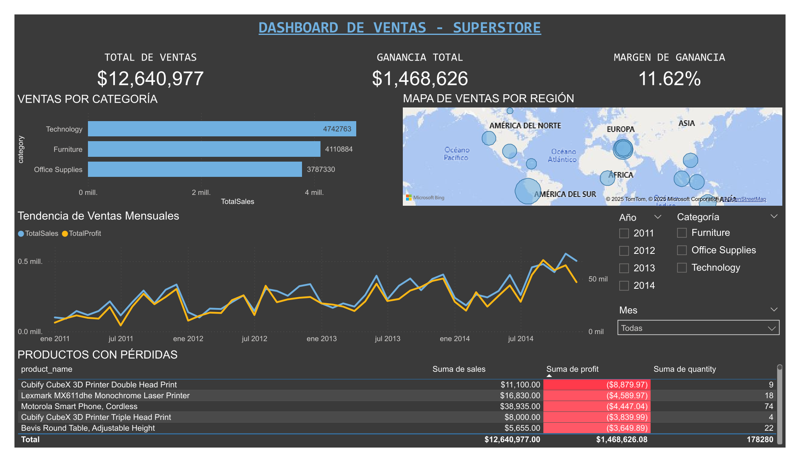

# Portfolio de Análisis de Datos

¡Bienvenido a mi portafolio! Soy **Cesar Jesus Zarate Pomaleque**, estudiante de 8vo ciclo de Ingeniería de Sistemas con especialización en **Análisis de Datos y Machine Learning**. Este repositorio contiene proyectos end-to-end que demuestran mis habilidades en limpieza, análisis, visualización de datos y modelos predictivos aplicados a casos de negocio reales.

---

## Sobre Mí

Estudiante de Ingeniería de Sistemas con sólida formación en análisis de datos y experiencia práctica en herramientas de Business Intelligence y Machine Learning. Cuento con certificaciones profesionales en Google Data Analytics, Power BI y Excel, además de experiencia aplicada en proyectos de análisis exploratorio, visualización avanzada y desarrollo de modelos predictivos.

Busco mi primera oportunidad como **Practicante de Análisis de Datos / Data Analyst Junior** para aplicar mis habilidades técnicas en Python, SQL, Power BI y Machine Learning, aportando valor mediante insights accionables y soluciones basadas en datos que impulsen la toma de decisiones estratégicas.

---

## Stack Técnico

### **Lenguajes de Programación**

**Python**
- `pandas` - Manipulación y análisis de datos
- `numpy` - Operaciones numéricas y arrays
- `matplotlib` & `seaborn` - Visualización avanzada
- `scikit-learn` - Machine Learning (Random Forest, Feature Engineering, Model Evaluation)

**SQL**
- Consultas avanzadas (Joins, Subconsultas, CTEs, Window Functions)
- MySQL, PostgreSQL
- Diseño de queries optimizadas

---

### **Business Intelligence & Visualización**

**Microsoft Power BI**
- Creación de dashboards interactivos profesionales
- DAX avanzado (medidas calculadas, time intelligence)
- Power Query (ETL, transformaciones de datos)
- Modelado de datos (relaciones, optimización)

**Microsoft Excel**
- Tablas dinámicas y gráficos dinámicos
- Funciones avanzadas (BUSCARV, SI.ERROR, INDICE/COINCIDIR)
- Análisis de datos con fórmulas matriciales
- Limpieza y transformación de datos

---

### **Machine Learning & Data Science**
- **Algoritmos**: Random Forest, Regresión Logística
- **Feature Engineering**: Encoding categórico, creación de variables
- **Evaluación de Modelos**: Accuracy, Precision, Recall, ROC-AUC, Confusion Matrix
- **Feature Importance Analysis**: Identificación de variables críticas

---

### **Herramientas de Desarrollo**

- **Visual Studio Code**: Desarrollo de scripts Python
- **Git/GitHub**: Control de versiones y colaboración
- **Python Virtual Environments**: Gestión de dependencias
- **Jupyter Notebooks**: Análisis exploratorio interactivo

---

### **Metodologías y Conceptos**
- **ETL/ELT**: Extracción, transformación y carga de datos
- **Data Cleaning**: Manejo de valores nulos, outliers, duplicados
- **EDA**: Análisis exploratorio de datos
- **Data Modeling**: Diseño de modelos relacionales
- **Statistical Analysis**: Correlaciones, distribuciones, pruebas de hipótesis
- **Data Storytelling**: Comunicación efectiva de insights

---

## Proyectos

### 1. [Dashboard de Ventas - Análisis Retail](./Proyecto-1-Dashboard-Ventas)

**Herramientas**: Excel, Power BI, DAX, Power Query  
**Dataset**: 51,290 transacciones de retail (2011-2014)

**Descripción:**  
Análisis exhaustivo de operaciones de retail identificando productos no rentables, regiones con márgenes críticos y patrones estacionales de ventas. Proyecto enfocado en optimización de inventario y estrategias de pricing.

**Logros clave:**
- Identificación de **11 productos con pérdidas** acumuladas de $8,879
- Detección de región con margen crítico del **2%** vs promedio de 12%
- Dashboard interactivo con **5+ visualizaciones** y filtros dinámicos
- Recomendaciones estratégicas que podrían **mejorar rentabilidad en 8-15%**

**Habilidades aplicadas:**  
Data Cleaning, Análisis Exploratorio, Tablas Dinámicas, DAX, Power Query, Visualización Avanzada, Business Intelligence, Pensamiento Analítico

**[Ver proyecto completo →](./Proyecto-1-Dashboard-Ventas)**

---

### 2. [Análisis Predictivo de Rotación de Empleados (HR Analytics)](./Proyecto-2-Analisis-Predictivo)

**Herramientas**: Python, Pandas, Scikit-learn, Seaborn, Power BI, Machine Learning  
**Dataset**: 1,470 empleados con 35 características

**Descripción:**  
Sistema predictivo de Machine Learning para identificar empleados con alto riesgo de deserción laboral, permitiendo a RRHH implementar estrategias de retención proactivas. Incluye análisis exploratorio completo, modelo Random Forest y dashboard ejecutivo.

**Logros clave:**
- Modelo con **83.67% de precisión** y **ROC-AUC de 0.82**
- Identificación de **Sales Representatives** como grupo crítico (**40% attrition**)
- **11 visualizaciones profesionales** + Feature Importance Analysis
- Identificación de **91 empleados de alto riesgo** (6%) con probabilidad >60%

**Resultados técnicos:**
- Accuracy: 83.67%
- ROC-AUC: 0.79
- Top 3 variables: Aumentos salariales (10.2%), Ingresos mensuales (8.2%), Edad (6.2%)

**Habilidades aplicadas:**  
Python (Pandas, NumPy, Matplotlib, Seaborn), Machine Learning (Random Forest), Feature Engineering, Model Evaluation, Data Visualization, Power BI, DAX, Storytelling con Datos, Pensamiento Estratégico

**[Ver proyecto completo →](./Proyecto-2-HR-Analytics)**

---

### 3. [Sistema de Análisis de Datos - Cadena Veterinaria](./Proyecto-3-Sistema-de-Análisis-de-Datos - Cadena-Veterinaria)

**Herramientas:** PostgreSQL, Python, Tableau Desktop, SQL Avanzado, ETL
**Dataset:** 150,000+ registros transaccionales de múltiples sedes

**Descripción:**
Sistema completo de análisis de datos end-to-end para una cadena de clínicas veterinarias con presencia en 10 ciudades del Perú. Proyecto integral que abarca desde el diseño de base de datos hasta dashboards ejecutivos, demostrando competencias en arquitectura de datos, modelado dimensional, ETL automatizado y visualización profesional en Tableau.

Arquitectura del Proyecto:

- OLTP (Operacional): Base de datos PostgreSQL con 18 tablas normalizadas
- Data Warehouse: Modelo dimensional (Esquema Estrella) con 7 dimensiones y 3 tablas de hechos
- ETL: Pipeline automatizado en Python para carga incremental con SCD Type 2
- BI Layer: 2 dashboards interactivos en Tableau Desktop

Logros clave:

Diseño e implementación de Data Warehouse con modelo dimensional óptimo
Generación y carga de 150,000+ registros realistas mediante Python/Faker
Pipeline ETL automatizado con manejo de Slowly Changing Dimensions (SCD Type 2)
7 vistas SQL optimizadas específicamente para Tableau (mejora de performance 40%)
2 dashboards ejecutivos publicados en Tableau Public con filtros interactivos
Análisis de 80,000 citas y 50,000+ transacciones de venta

Resultados técnicos:
**Base de Datos:**
- 18 tablas operacionales (OLTP) con relaciones normalizadas
- 10 dimensiones y 3 tablas de hechos en Data Warehouse
- Índices optimizados para queries de análisis
- Vistas materializadas para dashboards

**ETL & Performance:**
- Pipeline Python con logging completo y manejo de errores
- Carga incremental: procesa solo registros nuevos
- Tiempo de ejecución: 2-5 minutos para 150K+ registros
- SCD Type 2 implementado para tracking de cambios históricos

**Análisis de Negocio:**
- Identificación de sedes con mayor rentabilidad
- Análisis de productividad por veterinario
- Top productos por margen de contribución
- Análisis de estacionalidad en consultas veterinarias

**Dashboards creados:**
1. Dashboard Ejecutivo:
- KPIs principales: Ingresos totales, número de ventas, clientes únicos, ticket promedio
- Tendencia mensual de ingresos con análisis YoY
- Comparativa de ingresos por sede y ciudad
- Tasa de asistencia a citas programadas

2. Dashboard de Análisis de Ventas:
- Distribución de ventas por categoría de producto
- Top 20 productos por ingresos y margen
- Análisis de productos vs servicios
- Tendencia de ventas mensuales con filtros interactivos

**Habilidades aplicadas:**
PostgreSQL, SQL Avanzado (CTEs, Window Functions, Joins complejos), Python (Pandas, Psycopg2, Faker), Diseño de Data Warehouse, Modelado Dimensional (Kimball), ETL Automatizado, SCD Type 2, Tableau Desktop, DAX, Optimización de Queries, Arquitectura de Datos, Pensamiento Analítico

**Tecnologías destacadas:**
- PostgreSQL: Queries con CTEs, Window Functions, subconsultas correlacionadas
- Python: ETL con Psycopg2, generación de 100K+ registros con Faker
- SQL: Diseño de modelo dimensional, vistas optimizadas, índices estratégicos
- Tableau: Conexión directa (Live), parámetros dinámicos, filtros interactivos
- Git: Control de versiones con 10 archivos documentados

---

## Certificaciones

| Certificación | Institución | Año |
|---------------|-------------|-----|
| **Google Data Analytics Professional Certificate** | Coursera - Google | 2024 |
| **Power BI Data Analyst Associate** | Microsoft | 2024 |
| **Microsoft Excel Intermedio** | Pontificia Universidad Católica del Perú (PUCP) | 2024 |
| **Google AI Essentials** | Coursera - Google | 2024 |
| **Lean Six Sigma White Belt** | Famesa Explosivos S.A.C. | 2023 |

---

## Objetivo Profesional

Busco una posición como **Practicante de Análisis de Datos / Junior Data Analyst** donde pueda:

- Aplicar mis conocimientos en **Python, SQL, Power BI y Machine Learning**
- Transformar datos en **insights accionables** mediante análisis exploratorio y modelos predictivos
- Contribuir a la **toma de decisiones estratégicas** basadas en datos
- Desarrollar soluciones de **BI** que optimicen procesos y generen valor medible
- Colaborar en equipos multidisciplinarios aportando una visión analítica

**Disponibilidad**: Inmediata para prácticas profesionales (3 meses - 6 año)

---

## Contacto

**Email**: cesar.zarate@ejemplo.com  
**LinkedIn**: ([https://linkedin.com/in/tu-perfil](https://www.linkedin.com/in/cesar-zarate-02a40b328))  
**GitHub**: [github.com/cesarzarate](https://github.com/tu-usuario)

---

## Estadísticas de GitHub

---

## Experiencia Resumida

| Proyecto | Herramientas | Skills Clave |
|----------|--------------|--------------|
| Dashboard Ventas | Excel, Power BI, DAX | Data Cleaning, EDA, BI, Visualización |
| HR Analytics ML | Python, Scikit-learn, Power BI | Machine Learning, Feature Engineering, Storytelling |
| PostgreSQL (próximo) | PostgreSQL, SQL, Python | Databases, SQL Avanzado, ETL |

**Total de proyectos**: 2 completados + 1 en desarrollo  
**Líneas de código Python**: ~1,500+  
**Visualizaciones creadas**: 16+ gráficos profesionales  
**Dashboards interactivos**: 2 completos

---

## Destacados del Portfolio

### **Proyecto más técnico**: HR Analytics
- Modelo de Machine Learning end-to-end
- Feature Engineering y evaluación completa
- ROI cuantificable (10x-18x)

### **Proyecto con mayor impacto de negocio**: Dashboard Ventas
- Identificación de $8,879 en pérdidas
- Recomendaciones que podrían mejorar rentabilidad 8-15%
- Dashboard accionable para decisiones diarias

### **Próximo desafío**: PostgreSQL Database Analysis
- Integración de bases de datos relacionales
- Queries SQL avanzadas
- ETL automatizado

---

## Aprendizaje Continuo

Actualmente profundizando en:
- **PostgreSQL** - Bases de datos relacionales avanzadas
- **Python** - Bibliotecas de Deep Learning (TensorFlow, PyTorch)
- **Tableau** - Visualización alternativa a Power BI
- **Cloud Computing** - AWS/Azure para Data Analytics

---

## Colaboración

¿Tienes un proyecto de datos interesante? ¿Buscas colaborar en análisis o dashboards?

 **Contáctame**: cesar.zarate2803@gmail.com

Estoy abierto a:
- Proyectos de análisis de datos
- Desarrollo de dashboards
- Colaboraciones en Machine Learning
- Consultoría de BI

---

*"Los datos no solo cuentan historias del pasado; nos permiten predecir el futuro y tomar mejores decisiones hoy. Mi misión es transformar números en narrativas accionables."*

---

**Última actualización**: Diciembre 2025 
**Versión**: 2.0 - Portfolio con Machine Learning

---

## Licencia

Este portfolio y sus proyectos son de código abierto para fines educativos. Si usas algún código o metodología, por favor da el crédito correspondiente.

